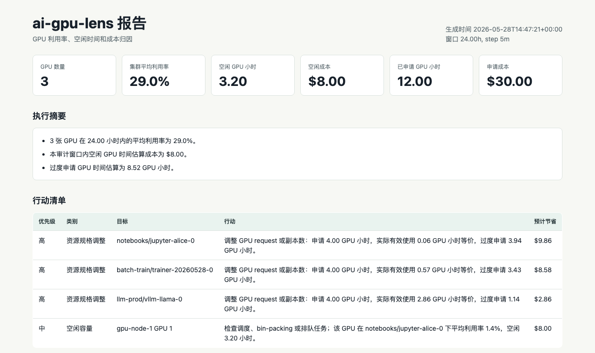

# Quickstart / 快速开始

This guide gets you from zero to a local GPU audit report in a few minutes.

这份文档帮助你在几分钟内生成第一份本地 GPU 审计报告。

## 1. Run The Sample

From a source checkout:

```bash
./bin/ai-gpu-lens audit \
  --from-file examples/sample-prometheus.json \
  --output reports/sample.html \
  --json-output reports/sample.json \
  --markdown-output reports/sample.md \
  --price-per-gpu-hour 2.50 \
  --language zh
```

Open `reports/sample.html` in a browser. The report includes:

- executive summary
- prioritized action items
- idle GPU ranking
- over-requested namespace and workload ranking
- per-GPU utilization and memory details
- telemetry gaps



## 2. Use The Released Container

```bash
docker run --rm ghcr.io/larainema/ai-gpu-lens:v0.4.0 --help
```

Run the bundled sample inside the image:

```bash
docker run --rm ghcr.io/larainema/ai-gpu-lens:v0.4.0 audit \
  --from-file examples/sample-prometheus.json \
  --output /tmp/sample.html \
  --json-output /tmp/sample.json \
  --markdown-output /tmp/sample.md
```

For real audits, mount local config and report directories:

```bash
mkdir -p local reports

docker run --rm \
  -v "$PWD/local:/configs:ro" \
  -v "$PWD/reports:/reports" \
  ghcr.io/larainema/ai-gpu-lens:v0.4.0 audit \
  --config /configs/grafana.yaml
```

Keep `local/` and `reports/` out of Git. They may contain environment names,
internal URLs, or customer data.

## 3. Install From GitHub

```bash
pipx install git+https://github.com/larainema/ai-gpu-lens.git
ai-gpu-lens --help
```

Or run directly from a checkout:

```bash
./bin/ai-gpu-lens --help
```

## 4. Audit Prometheus

```bash
ai-gpu-lens doctor \
  --prometheus-url http://prometheus.example.com:9090

ai-gpu-lens audit \
  --prometheus-url http://prometheus.example.com:9090 \
  --hours 168 \
  --step 5m \
  --price-per-gpu-hour 2.50 \
  --output reports/gpu-audit.html \
  --json-output reports/gpu-audit.json \
  --markdown-output reports/gpu-audit.md
```

Use a 24 hour window for a first smoke test. Use a 7 day window for a real
capacity or cost discussion.

## 5. Audit Through Grafana

If Prometheus is only reachable through Grafana, use the datasource proxy:

```bash
ai-gpu-lens doctor \
  --prometheus-url https://grafana.example.com/api/datasources/proxy/uid/prometheus \
  --basic-auth-user viewer \
  --prompt-basic-auth-password
```

Then run `audit` with the same endpoint and authentication settings.

See [Grafana datasource proxy](grafana-datasource-proxy.md) for details.

## 6. Create A Delivery Bundle

Use `bundle` when you want a shareable delivery package:

```bash
./bin/ai-gpu-lens bundle \
  --config examples/bundle.yaml
```

The bundle contains:

- `audit.html`
- `audit.json`
- `audit.md`
- `doctor.json` and `doctor.txt` for live endpoints
- `manifest.json`
- `README.md`
- a zip archive, unless `--no-archive` is set

## 7. Compare Two Audits

After a remediation pass, compare the baseline audit JSON with the follow-up
audit JSON:

```bash
./bin/ai-gpu-lens compare \
  --before reports/week-1/audit.json \
  --after reports/week-2/audit.json \
  --output reports/comparison.html \
  --json-output reports/comparison.json \
  --markdown-output reports/comparison.md \
  --language zh
```

Use the comparison report to review idle cost movement, over-requested GPU hour
changes, improved/regressed namespaces, improved/regressed workloads, and
telemetry gaps.

## 8. Generate A Grafana Dashboard

Generate an importable Grafana dashboard JSON file:

```bash
./bin/ai-gpu-lens dashboard \
  --output reports/ai-gpu-lens-dashboard.json
```

During import, select the Prometheus datasource that exposes DCGM exporter
metrics. If you know the datasource UID, bake it into the JSON:

```bash
./bin/ai-gpu-lens dashboard \
  --datasource-uid prometheus \
  --output reports/ai-gpu-lens-dashboard.json
```

## 中文速记

- 先用 sample 跑通：`./bin/ai-gpu-lens audit --from-file examples/sample-prometheus.json ...`
- 真实环境先跑 `doctor`，确认 DCGM、kube-state-metrics、workload labels 是否齐全。
- 初测用 24 小时窗口，正式审计用 7 天窗口。
- 要交付给别人时用 `bundle` 生成目录和 zip。
- 整改后用 `compare` 对比基线和复测 JSON，确认节省与回归。
- 需要持续可视化时用 `dashboard` 生成 Grafana JSON 后导入。
- 环境配置放 `local/`，报告放 `reports/`，两者都不要提交到 public repo。
