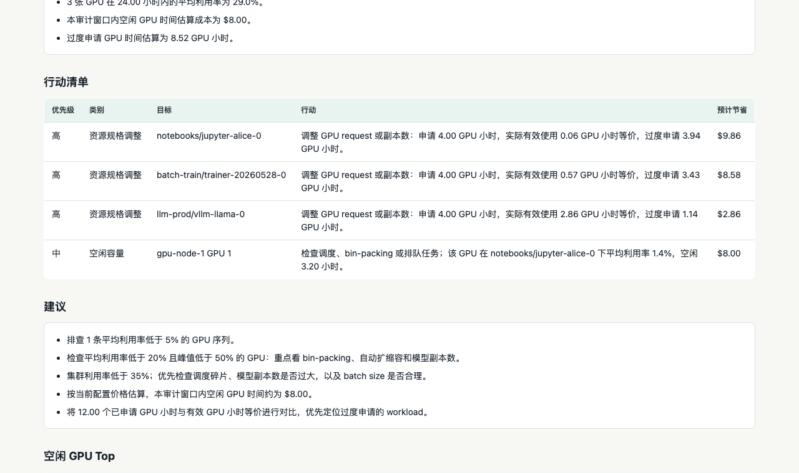
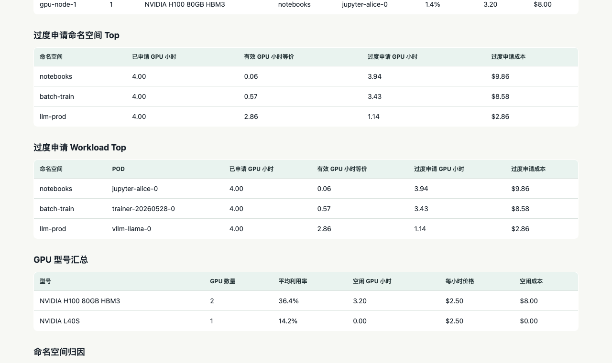

# Report Guide / 报告解读

`ai-gpu-lens` produces HTML, JSON, and Markdown reports. HTML is best for
interactive review, Markdown is best for customer notes, and JSON is best for
automation.

## Executive Summary

The executive summary answers three first-order questions:

- How many GPUs were observed?
- What was the fleet average utilization?
- How much idle or over-requested GPU time was detected?

Use this section to decide whether the audit window is worth deeper review.

## Action Items

Action items are intentionally short. They are designed to become a remediation
backlog, not a full root-cause analysis.



Each action item includes a confidence level and evidence:

- `High confidence`: workload-level request and utilization attribution match.
- `Medium confidence`: direct signal exists, but ownership or attribution should
  be checked before capacity changes.
- `Needs validation`: request-side waste is visible, but utilization is not
  attributed to the same namespace/workload.
- `Telemetry first`: fix metric or label gaps before using the audit for
  savings commitments.

Typical categories:

- `Right-sizing`: review GPU requests, replica counts, and workload sizing.
- `Idle capacity`: inspect scheduling, bin-packing, or queued work.
- `Telemetry`: fix missing labels or metrics before trusting attribution.
- `Validation`: run a longer window before making capacity changes.

When GPU attribution is ambiguous because DCGM emits duplicate series for the
same physical GPU, the report prefers namespace-level actions over overly
specific pod-level actions.

## Top Idle GPUs

This table ranks GPUs by estimated idle cost and idle hours.

Good follow-up questions:

- Is this a long-running notebook or training job that no longer needs a GPU?
- Is the workload waiting on CPU, storage, network, or data loading?
- Is the scheduler spreading small jobs across too many GPUs?
- Is the workload intentionally reserved for latency or failover?

## Over-requested Namespaces And Workloads

The report compares requested GPU hours with utilized GPU-hour equivalents.



Example:

```text
requested GPU hours: 100
utilized GPU-hour equivalent: 25
over-requested GPU hours: 75
```

This does not prove that 75 GPU hours can be removed immediately. It identifies
where to review requests, replicas, batch size, and scheduling policy first.

## GPU Model Summary

Use this section when different GPU types have different prices or scarcity.
An idle H100 should normally be reviewed before an idle lower-cost GPU.

Configure prices with:

```yaml
gpu_prices:
  default: 2.50
  H100: 4.25
  A100: 3.20
  L40S: 1.35
  4090: 0.65
```

Model names are matched exactly first, then by substring.

## Telemetry Gaps

Telemetry gaps are not failures. They describe what makes the audit less
precise.

Common gaps:

- missing kube-state-metrics GPU requests
- missing namespace or pod labels on DCGM metrics
- missing framebuffer memory metrics
- duplicate DCGM series for the same physical GPU

Fix telemetry gaps before using the report for chargeback, automated rightsizing,
or contractual savings commitments.

## 中文速记

- `执行摘要` 适合给老板或客户先看：多少 GPU、平均利用率、空闲/过度申请多少。
- `行动清单` 是整改 backlog 的起点，不是完整 RCA；优先看置信度和证据。
- `空闲 GPU Top` 用来优先排查 notebook、训练任务挂起、调度碎片、数据加载瓶颈。
- `过度申请` 是优先级信号，不等于可以立刻删除同等数量 GPU。
- `遥测缺口` 说明归因可信度边界，做 chargeback 或自动降配前应先修。
